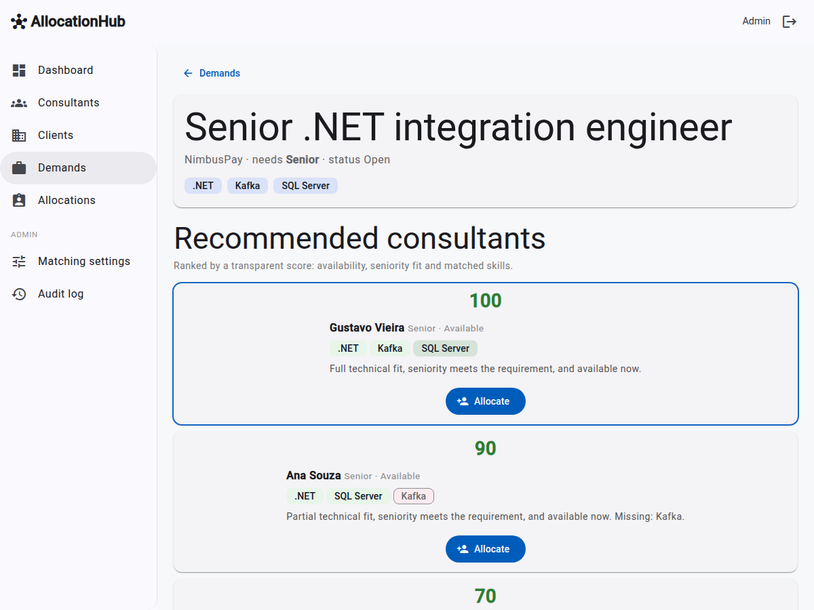
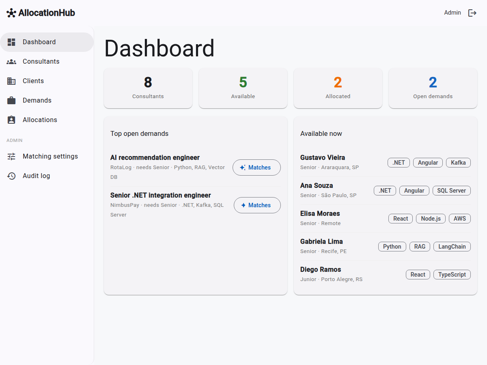

# AllocationHub

A staffing and allocation manager for a software house. You open a demand and get a ranked list of
consultants, each with a score you can explain to the client. One click turns the match into an
allocation. You register consultants, clients and client demands, then match the best available
consultants to a demand by skills, seniority and availability.

It models the core problem an outsourcing or squads-as-a-service company solves every day.



Stack: Angular + Angular Material (frontend) · ASP.NET Core / .NET 8 Web API (backend) · EF Core +
SQLite · JWT auth. Architecture: **Clean Architecture**. Dependencies point inward: `Api` →
`Infrastructure` → `Core`. `Core` depends on nothing.

## Demo flow (5 min)

Login as admin → operational dashboard → open a client demand → see the recommended ranking with
the score explanation → allocate a consultant → back to the dashboard, utilization updated.
See `docs/demo-script.md`.



## Run it

```bash
# Backend (http://localhost:5080, Swagger at /swagger)
cd src/AllocationHub.Api
DOTNET_SYSTEM_GLOBALIZATION_INVARIANT=1 dotnet run

# Frontend (http://localhost:4200)
cd web
npm install
npm start
```

Demo login: **admin@demo.com** / **admin123** (seeded on startup).

## Why this design

- Clean Architecture keeps the business rules (the matching score) independent of framework and
  database. The same reasoning transfers to any stack, Node/NestJS included. The matching rule lives
  in `Core`, is pure, and has unit tests that run without a database.
- Matching is deterministic and explainable, based on a transparent score. The human-readable
  explanation sits behind an interface (`IMatchExplanationService`) with an optional LLM
  implementation. AI never sits on the critical path of a demo, and the business rules are not
  coupled to an external vendor.

## Docs

- `specs/0001-allocationhub-mvp.md`: scope (in/out), entities, screens, endpoints.
- `docs/matching.md`: the score formula, example I/O, known limits.
- `docs/demo-script.md`: the literal presentation script.
